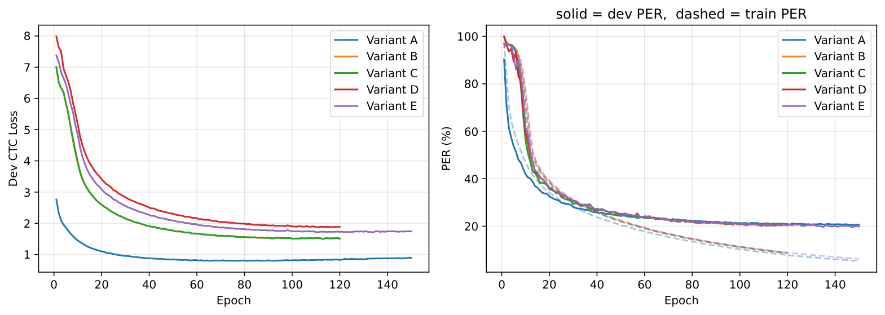
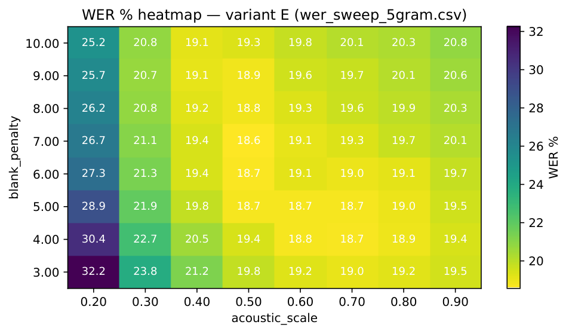

# Brain-to-Text: Skip-Diphone Auxiliary Supervision and Temporal Smoothness Regularization

A controlled ablation study on the **Brain-to-Text '24** intracortical speech BCI
benchmark. I extend the [DCoND](https://arxiv.org/abs/2411.10657) diphone decoder
with two acoustic-model objectives — a **skip-diphone auxiliary head** (`z_{t-2} → z_t`)
and a **temporal smoothness loss** — and run a full PER/WER ablation with a
leakage-free dev-split protocol and a matched-budget sanity check.

**TL;DR.** The skip-diphone objective improves phoneme accuracy (**PER −0.73 pp** vs. the
monophone baseline, from 20.48% → 19.75%), but that gain **does not transfer to word
error rate** under WFST-only decoding. This report treats that negative result as the
finding: I isolate *where* PER and WER diverge and give a testable hypothesis for why
(a blank/phone temporal-alignment effect the WFST decoder is sensitive to — stated as a
hypothesis, not a proven mechanism; see [§WER observations](#wer-observations)).

| Variant | Core setting | Test PER | 3-gram WER | 5-gram WER |
|---------|--------------|---------:|-----------:|-----------:|
| A | Monophone CTC baseline | 20.48% | 19.00%† | **18.07%** |
| B | Diphone (DCoND) | 20.41% | 19.23% | — |
| C | B + smoothness | 20.45% | **19.01%** | — |
| D | B + skip-diphone | 20.12% | 20.14% | — |
| **E** | **Full model (skip + smooth)** | **19.75%** | 19.31% | 18.56% |

<p align="center">
  
  
</p>

> Left: dev CTC loss / PER per variant (E reaches the lowest dev PER). Right: Variant E
> 5-gram WER over the `(acoustic_scale, blank_penalty)` sweep. Full analysis in
> [Results](#results); write-up in [docs/report.pdf](docs/report.pdf); motivation and
> evaluation plan in [docs/proposal.pdf](docs/proposal.pdf).

---

## Variants

| Variant | Description |
|---------|-------------|
| A | GRU + monophone CTC (NPTL baseline) |
| B | GRU + diphone CTC + marginalization (DCoND-style baseline) |
| C | B + temporal smoothness loss |
| D | B + skip-diphone auxiliary head |
| E | B + skip-diphone + temporal smoothness loss (full model) |

---

## Setup

- **Environments**: see [docs/INSTALL.md](docs/INSTALL.md). Two conda envs are
  used: `b2t` for training/PER and `lm_decode` for WFST WER decoding.
- **Data**: see [data/README.md](data/README.md) for downloading
  `competitionData.tar.gz`, converting to `competitionData.pkl`, and
  extracting `languageModel.tar.gz` (3-gram) or `languageModel_5gram.tar.gz`
  (optional, ≥32 GB RAM if `G_no_prune.fst` is kept).

---

## Tests & reproducibility

Unit tests cover the numerically load-bearing pieces — they need only
`torch`/`numpy` (no data, no LM), and run in ~1 s:

```bash
pip install pytest
pytest tests/ -q
```

- `test_loss.py` — smoothness loss: zero on constant posteriors, exact on a
  hand-computed case, invariant to padded frames.
- `test_model.py` — forward-pass smoke test + output-shape contract; diphone→phone
  marginalization (both the in-training sum and the WER-path `logsumexp`) stays a
  normalized distribution.
- `test_dataset.py` — adjacent-diphone / skip-diphone target construction, 1-indexed
  phoneme decoding, and collate padding/masking.

**Regenerating the tables and figures:** `notebooks/results.ipynb` reads the per-run
JSON summaries under `experiments/` and rebuilds the ablation table, the β/λ sweeps,
and the WER heatmap (the PNGs embedded above), so every reported number traces back to
a saved run rather than a hand-copied value.

---

## Methodology

The pkl `train` bucket is partitioned into **train** (~90%) and **dev**
(~10%, every `dev_stride`-th trial per day, deterministic). `best_dev.pt`
is selected on dev PER; pkl `test` is held out and only decoded once on
the final checkpoint. Set `dev_stride: 0` to fall back to the legacy
protocol of using `test` for both validation and reporting.

> **Note on absolute PER.** Numbers from the legacy "lowest test PER
> across epochs" protocol cherry-pick the best test epoch and are not
> directly comparable to dev-split numbers. Under the dev-split protocol
> here, the A→E gap is 0.73pp (honest) vs 1.95pp under legacy.

---

## Training

Variant A runs 80 epochs. Variants B/C/D/E run 120–150 epochs because the diphone and skip-diphone variants have larger output spaces and additional objectives.

```bash
# Variant A: monophone baseline
nohup python src/train.py \
  --variant A \
  --config configs/default.yaml \
  > experiments/variant_A.log 2>&1 &

# Variant B: diphone baseline
nohup python src/train.py \
  --variant B \
  --config configs/default.yaml \
  > experiments/variant_B.log 2>&1 &

# Variant C: diphone + smoothness
for lam in 1e-3 5e-3 1e-2; do
  nohup python src/train.py \
    --variant C \
    --lambda_smooth $lam \
    --config configs/default.yaml \
    > experiments/variant_C_lam${lam}.log 2>&1 &
done

# Variant D: diphone + skip-diphone
nohup python src/train.py \
  --variant D \
  --config configs/default.yaml \
  > experiments/variant_D.log 2>&1 &

# Variant E: full model
nohup python src/train.py \
  --variant E \
  --lambda_smooth 5e-3 \
  --config configs/default.yaml \
  > experiments/variant_E_lam5e-3.log 2>&1 &
```

`train.py` also accepts:
- `--alpha` (std-diphone CTC weight) — variants B/C/D/E
- `--beta` (skip-diphone CTC weight) — variants D/E
- `--lambda_smooth` (smoothness weight) — variants C/E
- `--seed` (RNG seed)
- `--num_epochs` (override default by variant)
- `--deterministic` (force deterministic cuDNN; ~20% slower)

All of α / β / λ / seed are reflected in the run directory name, so sweep
runs land in distinct directories under `experiments/`.

### β ablation (Variant D)

```bash
bash scripts/beta_sweep.sh   # trains D with beta in {0.05, 0.1, 0.2, 0.3}
```

### A@150 sanity check

```bash
bash scripts/sanity_a150.sh   # Variant A trained for 150 epochs (vs. default 80)
```

Confirms whether the gain of E (150 epochs) over A (80 epochs) comes from
the objective rather than just training time.

Monitor training:

```bash
tail -f experiments/<log_file>
```

For multi-GPU systems, prefix commands with:

```bash
CUDA_VISIBLE_DEVICES=<gpu_id>
```

---

## Evaluation

### Step 1 — PER (greedy CTC)

For Variant A the monophone head is decoded directly; for B–E, raw diphone
logits are marginalized to phoneme probabilities (log-sum-exp) before
CTC collapse. Decode every run on the test split:

```bash
for run in experiments/variant_*/; do
  v=$(basename "$run" | cut -d_ -f2)
  python src/decode.py \
    --checkpoint "$run/best_dev.pt" \
    --variant "$v" \
    --split test \
    --save_summary "$run/test_summary.json" \
    --config configs/default.yaml
done
```

`--save_summary` writes `{per, wer, split, ...}` so the notebook can pull
final numbers without re-running decode.

### Step 2 — WER (3-gram sweep, B/C/D/E)

WFST decoding uses the official speechBCI decoder (run in `lm_decode`).
The 3-gram TLG.fst is small enough to sweep every diphone variant:

```bash
conda activate lm_decode
nohup bash scripts/wer_sweep_all.sh > experiments/wer_sweep_all.log 2>&1 &
```

Iterates the 9 diphone seed42 runs sequentially over a 5×5 grid
(`ac ∈ {0.3, 0.5, 0.8, 1.0, 1.2}`, `bp ∈ {1.0, 2.0, 3.0, 4.0, 5.0}`),
writes per-run CSVs to `experiments/<run>/wer_sweep_3gram.csv`, and
prints a summary of the best `(acoustic_scale, blank_penalty, WER)` cell
per run. Variant A is excluded — its 3-gram WER (19.00% at ac=0.5,
bp=2.0, older narrower grid) is an **upper bound** since the bp curve was
still declining at bp=2.0. Each variant is evaluated at its own optimal
`(ac, bp)` because diphone outputs (1601-class softmax + marginalization)
and monophone outputs (direct 41-class softmax) have different calibrations
and different optimal cells.

### Step 3 — WER (5-gram sweep, A and E)

The 5-gram TLG.fst is ~42 GB, so we only sweep it on E (best PER) and A
(WER reference). Diphone variants need a wider bp range to compensate for
the softer marginalized phone distribution:

```bash
# E: ac 0.2–0.9, bp 3–10
nohup python scripts/wer_sweep.py \
    --checkpoint experiments/variant_E_alpha0.6_beta0.1_lam0.005_seed42/best_dev.pt \
    --variant E --lm 5gram --lm_dir data/speech_5gram/lang_test \
    --acoustic_scales 0.2 0.3 0.4 0.5 0.6 0.7 0.8 0.9 \
    --blank_penalties 3.0 4.0 5.0 6.0 7.0 8.0 9.0 10.0 \
    --out experiments/variant_E_alpha0.6_beta0.1_lam0.005_seed42/wer_sweep_5gram.csv \
    > experiments/variant_E_alpha0.6_beta0.1_lam0.005_seed42/wer_sweep_5gram.log 2>&1 &

# A: ac 0.3–1.1, bp 1–7
nohup python scripts/wer_sweep.py \
    --checkpoint experiments/variant_A_alpha0.6_beta0.1_lam0.001_seed42/best_dev.pt \
    --variant A --lm 5gram --lm_dir data/speech_5gram/lang_test \
    --acoustic_scales 0.3 0.5 0.7 0.9 1.1 \
    --blank_penalties 1.0 2.0 3.0 4.0 5.0 6.0 7.0 \
    --out experiments/variant_A_alpha0.6_beta0.1_lam0.001_seed42/wer_sweep_5gram.csv \
    > experiments/variant_A_alpha0.6_beta0.1_lam0.001_seed42/wer_sweep_5gram.log 2>&1 &
```

`wer_sweep.py` builds the decoder once per `acoustic_scale` and reuses it
across all `blank_penalty` values, so the ~42 GB FST is loaded N times
instead of N×M.

### Step 4 (optional) — GPT-2 n-best rescoring

Not claimed as a project contribution, but supported. Generate 100-best
with `--nbest 100 --save_nbest <path>`, then run `src/rescore.py
--nbest <path> --model_name gpt2 --alpha 0.5 --acoustic_scale <Step-3 ac>`.
The combination follows speechBCI/DCoND:
`total = α·GPT + (1−α)·LM + acoustic_scale·acoustic`.

---

## Results

Acoustic decoding results on the test split, under the dev-split protocol
(`best_dev.pt` selected on the held-out dev set, no test leakage).
WER uses WFST decoding with per-variant optimal `(acoustic_scale, blank_penalty)`.

### Combined ranking (sorted by PER)

| Rank | Variant | Core setting | Test PER | 3-gram WER | 5-gram WER |
|------|---------|--------------|---------:|-----------:|-----------:|
| 1 | E | Skip-diphone + smoothness, λ=0.005 | **19.75%** | 19.31% | 18.56% |
| 2 | D | Skip-diphone, β=0.2 | 20.12% | 20.14% | — |
| 3 | D | Skip-diphone, β=0.1 (default) | 20.20% | 20.05% | — |
| 4= | D | Skip-diphone, β=0.05 | 20.36% | 20.12% | — |
| 4= | C | Diphone + smoothness, λ=0.001 | 20.36% | 19.05% | — |
| 4= | C | Diphone + smoothness, λ=0.01 | 20.36% | 19.21% | — |
| 7 | B | Diphone baseline | 20.41% | 19.23% | — |
| 8 | C | Diphone + smoothness, λ=0.005 | 20.45% | **19.01%** | — |
| 9 | D | Skip-diphone, β=0.3 | 20.47% | 20.41% | — |
| 10 | A | Monophone CTC baseline (150 ep) | 20.48% | 19.00%† | **18.07%** |

† A's 3-gram sweep used an older narrower grid (`bp ∈ {0, 0.69, 1, 2}`); the bp curve was still
declining at bp=2.0, so 19.00% is an **upper bound** on A's 3-gram minimum.

Per-variant optimal cells: A peaks at (ac=0.5, bp=4) on 5-gram and (ac=0.5, bp=2) on 3-gram;
B/C/D peak at ac=0.8 on 3-gram; E uniquely peaks at ac=0.5 on both LMs — closer to A than to
the other diphone variants.

### WER observations

**Skip-diphone (D) hurts WER substantially despite helping PER.**
All four D variants land at 20.05–20.41% 3-gram WER — 0.8–1.2pp worse than B (19.23%) — even
though D β=0.1/0.2 have *better* PER than B. **Observation:** the skip-diphone head raises PER-level
accuracy but lowers WER. **Hypothesis:** because PER is read from a per-frame `argmax` while the
WFST decoder relies on *when* the blank/phone posterior spikes to place word boundaries, the skip
head's longer-range context may smear that temporal structure without hurting the frame-wise argmax.
This is *consistent with* — but not proven by — the data: what I can rule out is that it is a pure
marginalization artefact, since B/C use the same marginalization without the WER regression. It is
**not** ruled out that the cause is a calibration mismatch or under-tuned `(acoustic_scale,
blank_penalty)` rather than temporal alignment per se. Distinguishing these would require a direct
alignment measurement (blank-spike sharpness / forced-alignment entropy, or a temperature-rescaled
re-decode) — see [§Future work / limitations](#limitations).

**Smoothness (C) actually *helps* 3-gram WER.**
C λ=0.005 attains the best 3-gram WER overall (19.01%); all three C variants beat B's 19.23%.
Temporally smooth phone posteriors appear to make the lattice cleaner for the WFST.

**E (= D + C) sits in between.**
E achieves the best PER (−0.73pp vs A), but its 3-gram WER (19.31%) reflects D's regression
partially recovered by C's smoothness. On 5-gram, E's 18.56% is the best diphone result but
0.49pp behind A's 18.07%. The diphone marginalization (`logsumexp` over 40 contexts) yields a
softer phone distribution than direct monophone CTC, requiring a higher blank penalty to
recalibrate (E: bp=7 vs A: bp=4 on 5-gram); with the strong 5-gram LM dominating, this
miscalibration costs more.

**β / λ observations:**
- D's PER optimum is β=0.2 (20.12%); its WER optimum is β=0.1 (20.05%). β=0.3 hurts both.
- C's λ=0.005 wins WER (19.01%) despite having the worst PER among C runs (20.45%).
- E improves PER over B by 0.66pp but worsens 3-gram WER by 0.08pp.

**Sanity check (A@150):** A at 150 epochs reaches 20.48% PER — 0.73pp behind E — confirming
the gain is from the objective, not training time.

**Summary:** The acoustic-model claim (PER A→E −0.73pp) is supported. The WER claim is not
supported under WFST-only decoding: A wins 5-gram WER and C λ=0.005 wins 3-gram WER. Closing
this gap likely requires GPT-2 n-best rescoring (the missing half of the DCoND pipeline), a
diphone-aware decoder that avoids marginalization, or a modified skip-diphone head that preserves
blank/phone temporal calibration.

---

## Limitations

- **The temporal-alignment explanation is a hypothesis, not a measurement.** The PER↑/WER↓
  divergence for the skip-diphone variants is consistent with the skip head disrupting
  blank/phone temporal structure, but this project does not measure alignment directly. Competing
  explanations — a calibration/entropy mismatch, or an under-resolved `(acoustic_scale,
  blank_penalty)` grid — are not fully ruled out. A direct test would compare blank-spike
  sharpness or CTC forced-alignment entropy between the skip and non-skip variants, and check
  whether a temperature-rescaled re-decode of the skip posteriors recovers the WER gap.
- **WFST-only decoding.** WER omits the GPT-2 n-best rescoring stage of the DCoND pipeline
  (supported in `src/rescore.py` but not evaluated here), so absolute WER is above the full
  pipeline and the acoustic-model comparison is the intended read.
- **Single participant / single benchmark.** Results are on the Brain-to-Text '24 data (participant
  T12); generalization across participants is out of scope.

---

## References

[1] F. R. Willett et al., A high-performance speech neuroprosthesis, *Nature* 620:1031–1036, 2023.  
[2] F. R. Willett et al., Data: A high-performance speech neuroprosthesis, *Dryad*, 2023. https://doi.org/10.5061/dryad.x69p8czpq  
[3] J. Li, T. Le, C. Fan, M. Chen, E. Shlizerman, Brain-to-Text Decoding with Context-Aware Neural Representations and LLMs, *arXiv:2411.10657*, 2024.  
[4] Brain-to-Text Benchmark '24, Eval.AI Challenge #2099. https://eval.ai/web/challenges/challenge-page/2099/overview  
[5] C. Fan et al., Neural Sequence Decoder, GitHub. https://github.com/cffan/neural_seq_decoder  
[6] F. Willett et al., speechBCI, GitHub. https://github.com/fwillett/speechBCI
